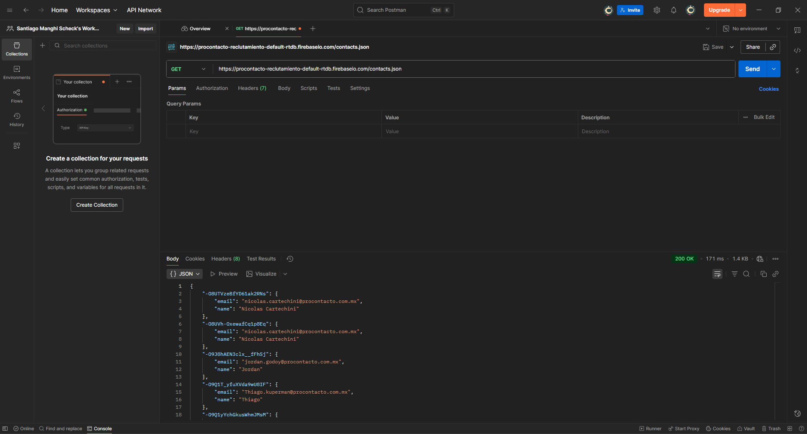
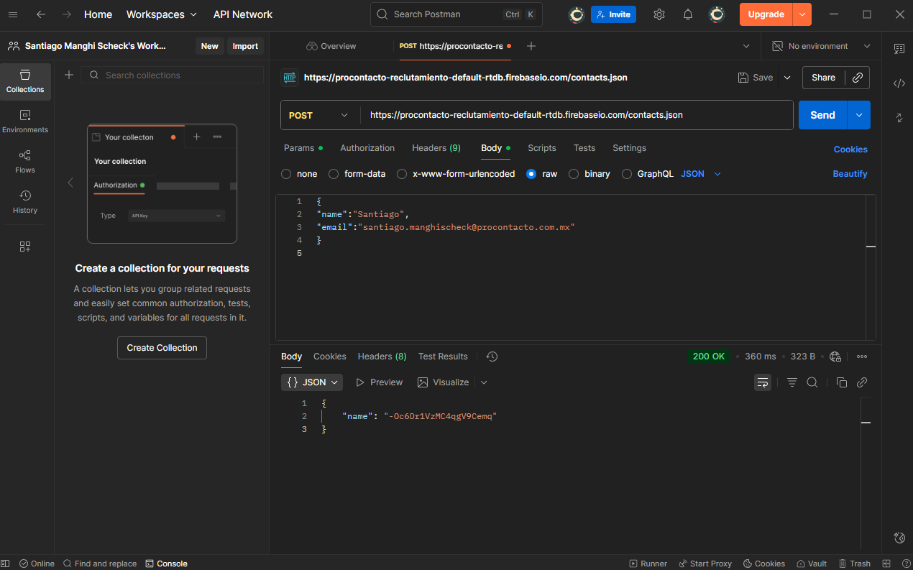
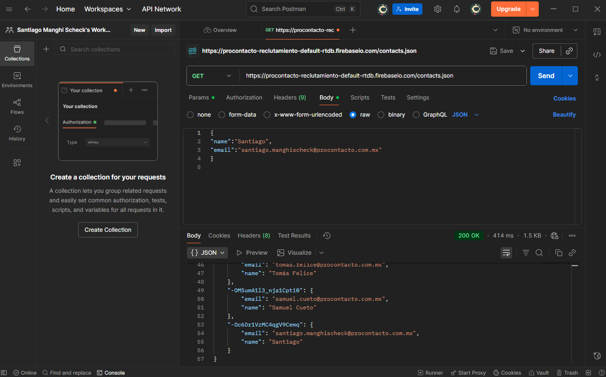
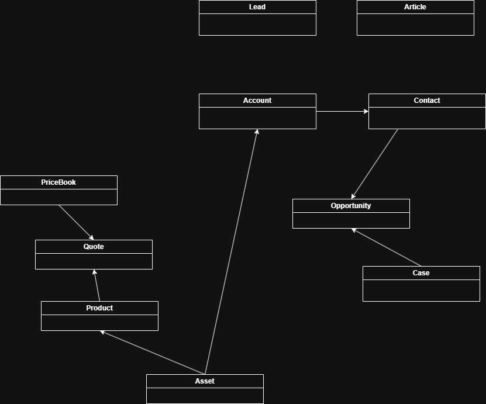

# ProContacto-Challenge

## Introducción  
Este repositorio contiene mis respuestas al Desafío Técnico de ProContacto. Se omite el ejercicio 1 debido a que consiste en preparativos para la realización de los ejercicios propuestos.

## Índice
- [Ejercicio 2](#ejercicio-2)
- [Ejercicio 3](#ejercicio-3)
- [Ejercicio 4](#ejercicio-4)
- [Ejercicio 5](#ejercicio-5)
- [Ejercicio 6](#ejercicio-6)
- [Ejercicio 7](#ejercicio-7)

---

## Ejercicio 2

### 1. ¿Qué es un servidor HTTP?
Un servidor HTTP es un software que procesa solicitudes (requests) y entrega respuestas (responses) con el contenido de un sitio web. Esta comunicación se realiza a través del protocolo HTTP, y los recursos son accedidos mediante URLs.

### 2. ¿Qué son los verbos HTTP? Mencionar los más conocidos
Los verbos HTTP (o métodos) indican la acción que el cliente desea realizar sobre un recurso específico en el servidor. Los más conocidos son:
* **GET**: Se utiliza para obtener datos del servidor.
* **POST**: Se utiliza para crear un nuevo recurso en el servidor.
* **PUT**: Reemplaza completamente un recurso ya existente en el servidor.
* **PATCH**: Modifica parcialmente un recurso existente.
* **DELETE**: Elimina un recurso del servidor.
* **HEAD**: Obtiene solo los encabezados (headers) de un recurso, sin el cuerpo.
* **OPTIONS**: Consulta los métodos y opciones de comunicación disponibles para un recurso del servidor.

### 3. ¿Qué es un request y un response en una comunicación HTTP? ¿Qué son los headers?
Un **request** (solicitud) es el mensaje que el cliente envía al servidor. Un **response** (respuesta) es el mensaje que el servidor devuelve al cliente tras procesar la solicitud.

Los **headers** (encabezados) son metadatos clave-valor que se envían tanto en la solicitud como en la respuesta. Proporcionan información esencial sobre el mensaje, como el tipo de contenido (`Content-Type`), autenticación, idioma preferido, etc.

### 4. ¿Qué es un queryString? (En el contexto de una url)
Es un conjunto de parámetros clave-valor incluidos al final de una URL. Comienzan con un signo de interrogación (`?`) y los pares se separan con un ampersand (`&`). Se utilizan comúnmente para enviar datos en solicitudes GET.

### 5. ¿Qué es el responseCode? ¿Qué significado tiene los posibles valores devueltos?
Un `responseCode` (código de respuesta) es un código numérico devuelto por el servidor que indica el resultado de la solicitud HTTP. Se agrupan en cinco rangos:
* **[100-199]**: Respuestas informativas.
* **[200-299]**: Respuestas exitosas (la solicitud se completó correctamente).
* **[300-399]**: Redirecciones (se necesita una acción adicional).
* **[400-499]**: Errores del cliente (la solicitud es incorrecta).
* **[500-599]**: Errores del servidor (el servidor falló al procesar la solicitud).

### 6. ¿Cómo se envía la data en un Get y cómo en un POST?
En **GET**, los datos se envían como parte de la URL. 
En **POST**, los datos se envían en el **cuerpo** del mensaje de la solicitud.

### 7. ¿Qué verbo http utiliza el navegador cuando accedemos a una página?
Utiliza el método GET.

### 8. Explicar brevemente qué son las estructuras de datos JSON y XML dando ejemplo de estructuras posibles.
Son formatos de texto estándar para estructurar e intercambiar datos.

Las estructuras JSON y XML son formas de organizar los datos. En JSON se usa un formato clave-valor. Por ejemplo:  

```json
{
  "name": "Santiago",
  "pasatiempos": ["leer", "videojuegos", "youtuber"]
}
```

En XML es una estructura mas echa para computadoras, poniendo valores entre etiquetas. Por ejemplo:  

```xml
<Name>Santiago</Name>
<Pasatiempos>
  <Pasatiempo>leer</Pasatiempo>
  <Pasatiempo>videojuegos</Pasatiempo>
</Pasatiempos>
```

### 9. Explicar brevemente el estándar SOAP

SOAP (Simple Object Access Protocol) es un protocolo basado en XML para intercambiar información estructurada en la implementación de servicios web.

### 10. Explicar brevemente el estándar REST Full 

REST (Representational State Transfer) es un estilo de arquitectura para diseñar aplicaciones en red. Una API RESTful es una API que sigue los principios de REST, utilizando los verbos HTTP para operar sobre los recursos.

### 11. ¿Qué son los headers en un request? ¿Para qué se utiliza el key Content-type en un header?

Los headers de un request son metadatos que proporcionan información adicional sobre la solicitud al servido. Por ejemplo autenticación o de idioma. El content-type es lo que indica el tipo de dato que se esta enviando en header del request.

---

## Ejercicio 3 
  
Se adjuntan las pruebas del ejercicio 3, del cual consistia en usar GET y POST con el software Postman para la pagina ProContacto  
  
Antes del POST  
  
POST  
  
Despues del POST  
  

**¿Qué diferencias se observan entre las llamadas el punto 1 y 3?**  
Tras hacer el POST, se subio mi nombre y email a la pagina.

---
## Ejercicio 4  

Link al perfil de Trailhead dónde hice los modulos pedidos:  
[Mi perfil de Trailhead](https://www.salesforce.com/trailblazer/e3a3wigv2bg9dt5063)


---
## Ejercicio 5

**1. Lead (Cliente Potencial):**
Es un cliente potencial a quien le ha interesado algún producto o servicio de tu empresa. Almacena datos como el nombre, la **compañía**, el email y el teléfono.

**2. Account (Cuenta):**
Es la empresa o entidad con la que tienes ya una relación de negocio (o potencial). Se almacenan datos como el nombre, la web, etc.

**3. Contact (Contacto):**
Es un comprador o persona individual de tu empresa, siempre asociado a una **Account**. Se guardan datos más personales como el nombre de cuenta al que pertenece, teléfono, fecha de nacimiento, correo, etc.

**4. Opportunity (Oportunidad):**
Es una venta en curso. Contiene datos como el nombre, la fecha de cierre prevista de la venta y el estado (etapa).

**5. Product (Producto):**
Es el producto o servicio que ofrece la empresa. Tiene datos como el nombre del producto, el código, la descripción y si está activo o no.

**6. PriceBook (Lista de Precios):**
Es donde se almacenan los precios por producto, permitiendo tener múltiples listas de precios para diferentes segmentos.

**7. Quote (Presupuesto/Cotización):**
Es donde se almacena el precio de los productos hacia un cliente específico, a menudo vinculado a una **Opportunity**.

**8. Asset (Activo):**
Es el producto que ya fue vendido o instalado al cliente y que está en uso. Contiene datos como el nombre del producto, la **Account** a la que pertenece y el estado del activo.

**9. Case (Caso):**
Es el reclamo, pregunta o solicitud de soporte de un cliente. Contiene el número de reporte, el estado, prioridad, etc.

**10. Article (Artículo):**
Contiene la solución a un problema o información de soporte, usado en la Base de Conocimiento (Knowledge Base). Tiene datos como el título, un resumen, etc.

  

---
## Ejercicio 6

### Soluciones de Salesforce

**A. ¿Qué es Salesforce?**  
Salesforce es una plataforma de gestión de empresas en la nube.

**B. ¿Qué es Sales Cloud?**  
Un software que automatiza el ciclo de ventas para ayudar a las empresas a vender sus productos.

**C. ¿Qué es Service Cloud?**  
Es una plataforma de servicio de atención al cliente que ayuda a empresas a gestionar y resolver consultas de índole soporte técnico.

**D. ¿Qué es Health Cloud?**  
Es una plataforma idéntica a Service Cloud pero enfocada en el sector de salud (trabajando con datos clínicos y no clínicos de un paciente).

**E. ¿Qué es Marketing Cloud?**  
Es una plataforma idéntica a las dos anteriores, pero esta vez enfocada en el mundo del marketing, trabajando con análisis y datos de campañas, redes, etc.

### Funcionalidades de Salesforce

**A. ¿Qué es un RecordType?**  
Es una herramienta para crear registros de un objeto.

**B. ¿Qué es un ReportType?**  
Representa los metadatos asociados a un tipo de informe personalizado.

**C. ¿Qué es un Page Layout?**  
Una herramienta para controlar la disposición y organización de las características de los objetos.

**D. ¿Qué es un Compact Layout?**  
Es una opción para mostrar los campos clave de un registro.

**E. ¿Qué es un Perfil?**  
Un conjunto de configuraciones y permisos que controla el acceso de un usuario a objetos y datos.

**F. ¿Qué es un Rol?**  
Un subconjunto de usuarios definidos del cual tienen acceso a determinados objetos.

**G. ¿Qué es un Validation Rule?**  
Una regla que valida los datos ingresados antes de guardarlos.

**H. ¿Qué diferencia hay entre una relación Master Detail y Lookup?**  
En Master Detail un objeto hijo no puede sobrevivir sin el padre. En Lookup el objeto hijo puede sobrevivir sin el padre.

**I. ¿Qué es un Sandbox?**  
Es una copia de un entorno de Salesforce para hacer pruebas de desarrollo.

**J. ¿Qué es un ChangeSet?**  
Es una herramienta de Salesforce para migrar metadatos de un *sandbox* a otro (o a producción).

**K. ¿Para qué sirve el Import Wizard de Salesforce?**  
Sirve para importar datos en masa.

**L. ¿Para qué sirve la funcionalidad Web to Lead?**  
Para generar un formulario web con la finalidad de crear *Leads*.

**M. ¿Para qué sirve la funcionalidad Web to Case?**  
Para generar un formulario web, pero con la finalidad de crear un *Case* (Caso).

**N. ¿Para qué sirve la funcionalidad Omnichannel?**  
Asigna *Cases* y *Leads* (o elementos de trabajo) a un agente para agilizar el trabajo.

**O. ¿Para qué sirve la funcionalidad Chatter?**  
Un foro de usuarios interno de Salesforce.

### Conceptos Generales  
  
**A. ¿Qué significa SaaS?**   
Significa *Software as a Service* (Software como Servicio), del cual es un modelo donde se alquila el uso de un determinado software.

**B. ¿Salesforce es SaaS?**   
Sí.

**C. ¿Qué significa que una solución sea Cloud?**   
Significa que la solución se ejecuta en algún servidor externo a la empresa (en la nube).

**D. ¿Qué significa que una solución sea On-Premise?**   
Que la solución se ejecuta en algún servidor interno de la empresa.

**E. ¿Qué es un pipeline de ventas?**   
Un proceso de ventas del cual se divide en etapas.

**F. ¿Qué es un funnel de ventas?**   
El número de clientes por etapa de venta (o una representación visual del proceso de conversión).

**G. ¿Qué significa Customer Experience?**   
Es la percepción total de un cliente que se crea a partir de sus interacciones.

**H. ¿Qué significa omnicanalidad?**  
Habilidad de un negocio para interactuar con clientes de manera integrada a través de múltiples canales.

**I. ¿Qué significa que un negocio sea B2B? ¿Qué significa que un negocio sea B2C? ¿Qué es un KPI?**   
B2B significa venta entre negocios. B2C significa venta a un cliente (consumidor), y KPI es una métrica clave de rendimiento (*Key Performance Indicator*) para medir el rendimiento (ej. de una venta).

**J. ¿Qué es una API y en qué se diferencia de una Rest API?**   
Una API es una interfaz que interactúa entre dos *softwares* o servidores distintos. La diferencia con REST API es que este último se especializa en el uso de HTTP y JSON con el fin de especializarse con navegadores web (Nota: REST API es un tipo de arquitectura API que usa protocolos como HTTP).

**K. ¿Qué es un Proceso Batch?**  
Proceso que permite ejecutar grandes volúmenes de datos.

**L. ¿Qué es Kanban?**  
Un método visual (etiquetas) para la gestión del flujo de trabajo y el estado de una tarea (*Pendiente, Terminado*, etc.).

**M. ¿Qué es un ERP?**  
Un ERP es un software que integra todas las áreas de una empresa (*Enterprise Resource Planning*).

**N. ¿Salesforce es un ERP?**  
No, ya que solo se enfoca en la relación de una empresa con sus clientes (CRM).

---

## Ejercicio 7

El codigo que usé para resolver el ejercicio es el siguiente:

Clase de Apex:
```apex
public class ejercicio7 {
    public class ContactResponse {
        public String email;
        public String name;
    }

    @future (callout=true)
    public static void getEmailFromProContacto(Set<Id> contactIds){
        // Obtenemos los contactos con el campo idprocontacto
        List<Contact> contactsToUpdate = [SELECT Id, idprocontacto__c, Email FROM Contact WHERE Id IN :contactIds AND idprocontacto__c != null];

        for(Contact c : contactsToUpdate){
            try{
                String endpoint = 'https://procontacto-reclutamiento-default-rtdb.firebaseio.com/contacts/' + c.idprocontacto__c + '.json';

                Http http = new Http();
                HttpRequest req = new HttpRequest();
                req.setEndpoint(endpoint);
                req.setMethod('GET');

                HttpResponse res = http.send(req);

                if(res.getStatusCode() == 200 && res.getBody() != null){
                    ContactResponse result = (ContactResponse) JSON.deserialize(res.getBody(), ContactResponse.class);

                    if(result != null && result.email != null){
                        c.Email = result.email;
                    }
                }
            } catch(Exception e){
                System.debug('Error:' + e.getMessage());
            }
        }
        if(!contactsToUpdate.isEmpty()){
            update contactsToUpdate;
        }
    }


}
```
Clase de Trigger:
```apex
trigger t_actualizarEmail on Contact (after insert, after update) {
    ContactTriggerHandler.processContacts(Trigger.new, Trigger.oldMap);
}
```
Clase de TriggerHandler:
```apex
public class ContactTriggerHandler {
	public static void processContacts(List<Contact> newList, Map<Id, Contact> oldMap){
        Set<Id> contactsToCall = new Set<Id>();

        for(Contact c : newList){
            // Si el campo está recién cargado o fue modificado, lo actualizo
            if((Trigger.isInsert && c.idprocontacto__c != null) ||
               (Trigger.isUpdate && c.idprocontacto__c != oldMap.get(c.Id).idprocontacto__c)){
                contactsToCall.add(c.Id);
            }
        }

        if(!contactsToCall.isEmpty()){
            ejercicio7.getEmailFromProContacto(contactsToCall);
        }
    }
}
```

